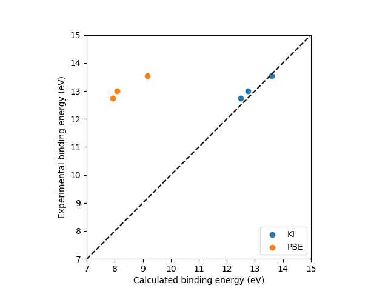

# Exercise 2: Ionisation potential and electron affinity of ozone

**Tutors**: Nicola Colonna and Edward Linscott

In this exercise you will use the [`koopmans`](https://koopmans-functionals.org) package to compute the ionisation potential (IP) and electron affinity (EA) of the ozone molecule with the KI functional. The screening parameters will be calculated via the **ΔSCF** method.

## Files provided

- [`ozone.json`](ozone.json) — the input file for the calculation
- [`read.ipynb`](read.ipynb) — a small `jupyter` notebook that extracts the IP and EA from the `koopmans` output
- [`plot_spectrum.ipynb`](plot_spectrum.ipynb) — an incomplete `jupyter` notebook for plotting the orbital binding energies against experiment

## Problem 1: Understanding the input file

Open [`ozone.json`](ozone.json) and inspect the `workflow` block. You should see the following keys (among others):

```json
"functional": "ki",
"method": "dscf",
"init_orbitals": "kohn-sham",
"alpha_numsteps": 1,
"pseudo_library": "SG15/1.2/PBE/SR"
```

### Part A

What does each of `functional`, `method`, and `init_orbitals` control?

<details>
<summary><b>Solution</b></summary>

- `"functional": "ki"` selects the Koopmans integral (KI) functional
- `"method": "dscf"` selects that we will calculate the screening parameters with the ΔSCF approach
- `"init_orbitals": "kohn-sham"` means that we will use Kohn-Sham orbitals to initialize the variational orbitals. (And because the KI functional isn't actually orbital-dependent, they will _remain_ the variational orbitals.)

</details>

### Part B

Inspect the `atoms` block — what is the geometry of the system? Why is the simulation cell so much larger than the molecule itself?

<details>
<summary><b>Solution</b></summary>
- ozone is a bent molecule, with a bond length ≈ 1.27 Å and a bond angle of 117°
- the simulation cell is padded with vacuum so the molecule does not interact with its periodic images (plane-wave codes still use a supercell internally, even when the system is treated as non-periodic)

> [!NOTE]
> The padding is especially important for ΔSCF calculations, where we will be performing calculations in which the molecule acquires a net charge — charged periodic images interact through the long-range Coulomb tail, so the vacuum buffer needs to be even larger than for the neutral system. In addition to using a larger vacuum buffer, these effects are mitigated through reciprocal-space counter-charge correction schemes, which compensate for the artificial electrostatic interaction between periodic images[^LiDabo2011].

</details>

## Problem 2: Running the calculation

Run the workflow with

```bash
koopmans run ozone.json | tee ozone.md
```

When the calculation finishes, open `ozone.md`. This file is a human-readable outline of the workflow that `koopmans` just executed. (It is markdown, so it renders nicely in `vscode` and on GitHub.)

You should see that the workflow consists of three phases:

1. **Initialization** — preparing the density and variational orbitals.
2. **Calculating the screening parameters** — one $\alpha_i$ per orbital.
3. **The final KI calculation** — applying the corrections.

Identify the three phases in `ozone.md` and the calculation sub-directories they correspond to (all of them live under `01-koopmans-dscf/`).

<details>
<summary><b>Solution</b></summary>

- **Initialization** → `01-initialization/`
- **Calculating the screening parameters** → `02-calculate-screening-via-dscf/`
- **Final KI calculation** → `03-ki_final/`

</details>

## Problem 3: The initialization step

You should see that the initialization phase runs **four** separate PBE calculations, all under `01-koopmans-dscf/01-initialization/`:

```text
01-dft_init_nspin1
02-dft_init_nspin2_dummy
03-convert_files_from_spin1to2
04-dft_init_nspin2
```

In this procedure we solve the DFT problem with `nspin=1` (i.e. enforcing that the spin-up and spin-down densities match), do some bookkeeping that then ultimately allows us to perform a `nspin=2` calculation (i.e. no longer enforcing the matching between the spin-up and spin-down densities) starting from the `nspin=1` wavefunctions duplicated into both spin channels. 

Why bother with this four-step initialization instead of running a single `nspin = 2` PBE calculation from scratch as we did in the previous exercise?

<details>
<summary><b>Solution</b></summary>

For ozone (a closed-shell molecule) a direct `nspin = 2` run actually converges to the correct spin-restricted solution. The four-step protocol is there for two reasons:

- **Safety:** in harder systems, an unrestricted `nspin = 2` calculation started from scratch can erroneously collapse into a spurious broken-symmetry spin-polarized solution. Initialising from a converged `nspin = 1` density reduces that risk by handing the `nspin = 2` calculation an already-symmetric starting point.
- **Efficiency:** solving the `nspin = 1` problem is cheaper (half the wavefunctions), so most of the SCF cycles are done in the smaller problem; the `nspin = 2` calculation that follows starts from an already-converged density should finish quickly.

</details>
</br>

> [!NOTE]
> From this point onward in the workflow the density will not change. This is because the KI functional, by construction, gives back the same density as its base functional (here PBE). This is *not* true for KIPZ — there, the density does change.


## Problem 4: Calculating the screening parameters

The second phase of the workflow computes one screening parameter $\alpha_i$ per orbital, using the ΔSCF method (see the lecture).

These calculations live under `01-koopmans-dscf/02-calculate-screening-via-dscf/`. Each iteration begins with a trial KI calculation (`01-ki`), followed by one sub-directory per orbital (`02-orbital-1`, `03-orbital-2`, ..., `11-orbital-10`).

For each *filled* orbital $i$ (orbitals 1–9 of ozone), the code performs a single constrained $N{-}1$-electron PBE calculation in which orbital $i$ is frozen and emptied while the remaining density is allowed to relax. This yields $E_i(N{-}1)$, which combined with $E(N)$, $\lambda_{ii}^\alpha(1)$, and $\lambda_{ii}^0(1)$ (all of which come from the trial KI calculation) is enough to update $\alpha_i$ from its initial guess of $\alpha_i^0 = 0.6$. This is exactly the same linear-extrapolation formula you derived and applied to the HOMO in Exercise 1 — `koopmans` is simply running it for every orbital.

For the *empty* orbital 10, inside `01-iteration-1/11-orbital-10/` you will see three calculations rather than one:

```text
01-dft_n+1_dummy
02-pz_print
03-dft_n+1
```

The third of these is the constrained $N{+}1$-electron PBE calculation analogous to the $N{-}1$ ones for the filled orbitals. The first two contain preparatory calculations that assemble the files required by the third.

### Part A

At the end of the screening-parameters phase, `ozone.md` contains two tables. The first lists $\alpha_i$ for each iteration, and the second lists the residual $\Delta E_i - \lambda_{ii}^\alpha$ — the convergence criterion for the screening procedure. Inspect both. Do the residuals indicate that the screening parameters have converged?

<details>
<summary><b>Solution</b></summary>

No — the residuals are well above the default convergence threshold. With `alpha_numsteps = 1` the screening loop has updated each $\alpha_i$ only *once* from the initial guess of 0.6; the residual corresponds to this initial guess, and the updated values have not yet been used as inputs to a calculation that measures this error.

</details>

### Part B

In `ozone.json`, increase `alpha_numsteps` from `1` to `2` and change `from_scratch` to `false` and re-run the workflow. (`from_scratch = False` will mean that the workflow will pick up from where the `alpha_numsteps = 1` workflow left off.) Now the screening loop runs to self-consistency: each row of the $\alpha$ table is the input to the calculation in the next row. What do you notice?

<details>
<summary><b>Solution</b></summary>

- the code already knows to skip the $N-1$ calculations
- it still recalculates the empty orbitals (because formally the empty variational orbitals are not independent of the screening parameters)
- all the residual errors are tiny

</details>

## Problem 5: Extracting the IP and the EA

The KI ionisation potential is $-\varepsilon_\text{HOMO}$ from the final KI calculation, and likewise the electron affinity is $-\varepsilon_\text{LUMO}$.

### Part A

Open `01-koopmans-dscf/03-ki_final/ki_final.cpo` and locate the HOMO and LUMO eigenvalues. What do you get?

<details>
<summary><b>Solution</b></summary>

You should find something like

```text
HOMO Eigenvalue (eV)

  -12.4945

LUMO Eigenvalue (eV)

   -1.7184
```

</details>

### Part B

For comparison, dig out the corresponding PBE values from the final initialization calculation (`01-koopmans-dscf/01-initialization/04-dft_init_nspin2/dft_init_nspin2.cpo`).

<details>
<summary><b>Solution</b></summary>

You should find something like

```text
   HOMO Eigenvalue (eV)

   -7.9229

   LUMO Eigenvalue (eV)

   -6.1058
```

</details>

### Part C

Compare your KI and PBE results against the experimental values for ozone:

- IP ≈ 12.5 eV[^NIST-O3]
- EA ≈ 2.1 eV

### Part D

If you prefer to work in `python`, it is easy to do this: see the `read.ipynb` notebook provided. It loads the `ozone.pkl` file generated by `koopmans` and prints the IP and EA. Open it, run all the cells, and check that you get the same numbers as in Part A.

## Part E: One $\alpha$ vs orbital-dependent $\alpha_i$

In Exercise 1 you computed a *single* $\alpha$ — fitted to the HOMO — and applied it to every orbital. In this exercise, `koopmans` instead computes a separate $\alpha_i$ for each orbital (the **orbital-density-dependent (ODD)** approach). Go back to your final KI output from Exercise 1 (`ozone_ki_opt.out`), and compare the resulting IP and EA to what you obtained here.

<details>
<summary><b>Solution</b></summary>

- The **IP is the same by construction** in both cases: the single $\alpha$ from Exercise 1 was fitted to enforce the Koopmans condition on the HOMO, so the HOMO eigenvalue — and hence the IP — matches the ODD result.
- The **EA, however, is noticeably worse** with the single $\alpha$: you should find EA ≈ 1.37 eV from Exercise 1, compared to EA ≈ 1.72 eV with orbital-dependent screening. The latter is significantly closer to the experimental value of ≈ 2.1 eV.

This illustrates why ODD screening matters: an $\alpha$ tuned for the HOMO cannot simultaneously describe the LUMO well.

</details>

## Problem 6: Comparing the full spectrum to experiment

So far you have only looked at the HOMO and LUMO. The KI functional in fact predicts a binding energy for *every* occupied orbital, and these can be compared directly against gas-phase photoemission spectroscopy.

The [`plot_spectrum.ipynb`](plot_spectrum.ipynb) notebook contains experimental binding energies (in eV) for the outermost three occupied orbitals of ozone[^Mocellin2003].

Complete the notebook. It loads `ozone.pkl`, extracts both the KI and the PBE orbital eigenvalues, converts them into binding energies, and plots them against the experimental values. Open the notebook, fill in the cells marked `TODO`, and run all the cells to produce the comparison plot.

<details>
<summary><b>Solution</b></summary>



</details>

## Problem 7: Molecular oxygen [OPTIONAL]

Try modifying the input file from ozone to O₂, and see if you can get an ionization potential and electron affinity that compare well to experiment [^NIST-O2].

When writing your input file, remember...
- O₂ is a linear molecule with a bond length of 1.21 Å
- it is paramagnetic, so you will need to set `spin_polarized = true` in the `workflow` block
- change any other relevant parameters

<details>
<summary><b>Solution</b></summary>

Update...
- `spin_polarized = True`
- `tot_magnetization = 2`
- `nbnd = 8`

as well as the list of atoms and their coordinates.

A full input file can be found [here](solutions/o2.json). It gives an IP and EA of 11.78 and 0.45 eV respectively; cf. the experimental values of 12.07 and 0.45 eV[^NIST-O2].

</details>

## Problem 9: Take-aways

A Koopmans calculation requires running many constrained DFT calculations — one per orbital (and even more for empty orbitals). What does this imply about how the cost of a ΔSCF Koopmans calculation scales with system size? What does it imply for *periodic* systems, where the variational orbitals are spread throughout the crystal and the supercell needs to be made large enough to host the constrained $N\pm1$ density?

<details>
<summary><b>Solution</b></summary>

- **For molecules:** each screening iteration needs ~one constrained DFT calculation per orbital, and the number of orbitals scales with system size. So ΔSCF Koopmans is roughly a factor of $N_\text{orb}$ more expensive than a single DFT calculation — and self-consistency multiplies that by `alpha_numsteps`.
- **For periodic systems:** worse still. Each constrained $N{\pm}1$ calculation needs a *supercell* big enough that the extra electron (or hole) localises and does not overlap with its periodic images. The supercell volume grows with the localisation length of the variational orbital, so every single calculation in the screening loop is far more expensive than a corresponding primitive-cell calculation — on top of the $N_\text{orb}$ factor.
- This makes ΔSCF impractical for crystals, and motivates the switch to DFPT in Exercise 3.

</details>
<br>

The final exercise, on bulk silicon, addresses exactly this issue by using a different — much more efficient — method for computing the screening parameters: density-functional perturbation theory (DFPT).


[^NIST-O3]: [NIST Chemistry WebBook, SRD 69 — Ozone, ion energetics](https://webbook.nist.gov/cgi/cbook.cgi?ID=C10028156&Mask=20#Ion-Energetics).
[^NIST-O2]: [NIST Chemistry WebBook, SRD 69 — Molecular oxygen, ion energetics](https://webbook.nist.gov/cgi/cbook.cgi?ID=C7782447&Mask=20#Ion-Energetics).
[^Mocellin2003]: A. Mocellin *et al.*, *Ozone valence photoelectron spectroscopy revisited*, [*Chem. Phys. Lett.* **375**, 76 (2003)](https://doi.org/10.1016/S0009-2614(03)00818-2).
[^LiDabo2011]: Y. Li and I. Dabo, *Electronic levels and electrical response of periodic molecular structures from plane-wave orbital-dependent calculations*, [*Phys. Rev. B* **84**, 155127 (2011)](https://doi.org/10.1103/PhysRevB.84.155127).
