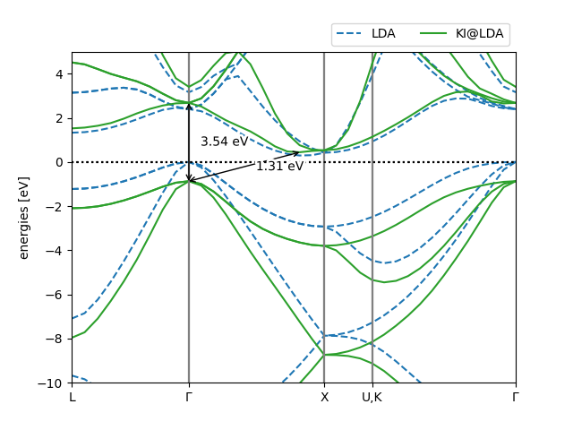
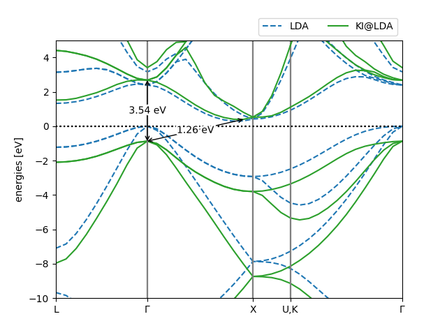

# Exercise 3: Band structure of bulk Si with KI and DFPT

**Tutors**: Nicola Colonna and Edward Linscott

In this exercise you will compute the KI band structure of bulk silicon. There are two important differences with the ozone calculation of Exercise 2:

1. **The variational orbitals are now maximally-localised Wannier functions (MLWFs)** instead of Kohn–Sham orbitals.
2. **The screening parameters are computed via DFPT** instead of via constrained ΔSCF calculations in a supercell.

## Files provided

- `si.json` — the input file for the calculation
- `plot_bandstructures.py` — a `python` script to plot the LDA and KI band structures side by side

## Problem 1: Understanding the input file

Open `si.json` and locate the `workflow` block:

```json
{
  "workflow": {
    "task": "singlepoint",
    "functional": "ki",
    "method": "dfpt",
    "gb_correction": false,
    "init_orbitals": "mlwfs",
    "orbital_groups_spread_tol": 0.01,
    "pseudo_library": "PseudoDojo/0.4/LDA/SR/standard/upf",
    "calculate_bands": true
  }
}
```

Compare this block against the one from Exercise 2. Identify and try to understand each difference:

- `task: singlepoint` (we'll change this in Problems 2 and 3)
- `method: dfpt` instead of `dscf`
- `init_orbitals: mlwfs` instead of `kohn-sham`
- no `alpha_numsteps` — with DFPT the screening is obtained directly from linear response rather than by iterating on a starting guess
- `orbital_groups_spread_tol` — a tolerance for grouping orbitals

<details>
<summary><b>Solution</b></summary>

The input keywords are explained [here](https://koopmans-functionals.org/en/latest/input_file/workflow_keywords.html)

</details>

## Problem 2: The Wannierization

Before doing any Koopmans physics, we need a good set of Wannier functions. Whether they are "good" depends on whether the band structure they interpolate matches the explicit DFT band structure.

### Part A

Change `"task": "singlepoint"` to `"task": "wannierize"` in `si.json`, then run

```bash
koopmans run si.json | tee si_wannierize.md
```

This task performs an SCF calculation, an NSCF calculation, a Wannierization of each block of bands, and then an explicit DFT band-structure calculation on the same _**k**_-path for comparison. The workflow generates a plot `si_bandstructure.png` that overlays the interpolated and the explicit band structures.

### Part B

Inspect `si_bandstructure.png`. Do the interpolated bands lie on top of the explicit ones? If not, what could we do to fix this?

<details>
<summary><b>Solution</b></summary>

You should see some fairly substantial discrepancies between the actual and interpolated bands. This is because our calculation is underconverged.

To fix this, one would typically increase the size of the _**k**_-point mesh

</details>

## Problem 3: Running the KI calculation

Now change `"task"` back to `"singlepoint"` and, keeping the _**k**_-point grid at 2×2×2 (for the sake of speed), re-run

```bash
koopmans run si.json | tee si_ki.md
```

This time the workflow proceeds beyond the Wannierization to actually compute the KI band structure. Open `si_ki.md` and identify the following steps:

- a **Wannierization** block (the same one you just ran),
- a **`wann2kc`** step, which converts the Wannier90 files into a format readable by `kcw.x`,
- a **`screen`** step, in which the screening parameters $\alpha_i$ are computed via DFPT,
- a **`ham`** step, which constructs and diagonalises the Koopmans Hamiltonian,
- an **`unfold and interpolate`** step, which produces the final band structure.

### Part A

Contrast this workflow with the one you saw for ozone. In the DFPT workflow, where does the cost of computing the screening parameters go? Why is this expected to scale much better with system size than ΔSCF?

<details>
<summary><b>Solution</b></summary>

In ΔSCF the cost of one screening parameter is a supercell SCF, which scales as $(N_\mathrm{el}^\mathrm{SC})^3$ (where $N_\mathrm{el}^\mathrm{SC}$ is the number of electrons in the supercell). In DFPT we instead do a primitive-cell SCF — $(N_\mathrm{el}^\mathrm{PC})^3$ — repeated over $N_q$ monochromatic perturbations. Using $N_\mathrm{el}^\mathrm{SC} = N_k N_\mathrm{el}^\mathrm{PC}$ and $N_q = N_k$, the ratio of costs is $T_\mathrm{SC}/T_\mathrm{PC} \propto N_q$. Thus, as the supercell (equivalently, the _**q**_-grid) grows, DFPT wins by a factor of $N_q$.

</details>

### Part B

By construction, the Koopmans correction depends on the screening parameter $\alpha_i$ of each orbital — orbitals with $\alpha_i$ close to 1 are corrected strongly, while orbitals with $\alpha_i$ close to 0 are barely shifted. Inspect the screening parameters that were computed. These are printed in the `.kso` output files of `kcw.x`; you can quickly grab the relevant lines by running

```bash
grep -r 'alpha =' --include='*.kso'
```

How do they compare? What does this tell you about how strongly the electrons in a covalent semiconductor like silicon screen?

<details>
<summary><b>Solution</b></summary>

You should get screening parameters of around 0.2. This is reflective of the fact that electronic screening of charged excitations in silicon is _much_ stronger than it is in molecules such as ozone.

</details>

## Problem 4: Plotting and analysing the band structure

The `singlepoint` task generates a few plots automatically. But for a prettier, more comprehensive plot, run

```bash
python plot_bandstructures.py
```

This produces `si_bandstructures.png`, overlaying the LDA band structure against the KI@LDA one and labelling the band gap.

### Part A

Inspect `si_bandstructures.png`. What is the KI@LDA band gap? Compare it against

- the LDA band gap (try modifying the script so that it labels the LDA gaps instead)
- the experimental gap of 1.17 eV[^Madelung2004]. Our calculation is for a static lattice (it neglects electron–phonon coupling), so the fair comparison is against the experimental value with the zero-point renormalisation of 0.06 eV[^Miglio2020] added back — i.e. **1.23 eV**.

<details>
<summary><b>Solution</b></summary>



</details>

### Part B

Does anything about the Koopmans band structure that you obtain look strange, or indicative of underconvergence?

<details>
<summary><b>Solution</b></summary>
Look closely at the conduction band minimum (CBM) along the Γ–X segment in `si_bandstructures.png`. Here the band looks wiggly: it is not interpolating the bands very well.

</details>

### Part C

We have a trick to overcome this issue. The KI Hamiltonian splits into a DFT part and a small, slowly-varying Koopmans correction, so the interpolated Hamiltonian can be written as

```math
h^\mathrm{KI}_{mn}(\mathbf{k}) = \sum_{\mathbf{R}'} e^{i\mathbf{k}\cdot\mathbf{R}'} h^\mathrm{DFT}_{mn}(\mathbf{R}') + \sum_{\mathbf{R}} e^{i\mathbf{k}\cdot\mathbf{R}} v^\mathrm{KI}_{mn}(\mathbf{R})
```

In principle, there is no need for the two parts of the Hamiltonian to be evaluated on the same real-space mesh (or, equivalently the same _**q**_-point grid). Indeed, because the Koopmans correction is more slowly-varying, it can be evaluated on a coarser mesh. This is controlled by the `smooth_int_factor` keyword, which we were already using:


```json
"ui": {
    "smooth_int_factor": 3
}
```

in `si.json`. This factor defines how many times larger the DFT mesh is relative to the Koopmans mesh. Increasing `smooth_int_factor` refines that mesh. For example, repeating the same calculation with `smooth_int_factor: 4` yields the following bandstructure



The CBM region is now much better resolved. You don't need to rerun the workflow with this setting yourself — the DFT calculations become considerably more expensive — but it is worth being aware that the apparent quality of the CBM in your plot is sensitive to the underlying DFT calculation as well as the KI correction.

Why is this not true of the direct Γ → Γ gap?

<details>
<summary><b>Solution</b></summary>

Γ is included in the (uniform) 2×2×2 **k**-point grid on which the Koopmans Hamiltonian is computed, so its value there is exact — no interpolation is required. The CBM near X, by contrast, falls *between* the points of this coarse mesh, so its energy is reconstructed by the smooth-interpolation procedure and is sensitive to `smooth_int_factor`.

</details>

[^Nguyen2018]: N. L. Nguyen, N. Colonna, A. Ferretti, and N. Marzari, *Koopmans-Compliant Spectral Functionals for Extended Systems*, Phys. Rev. X **8**, 021051 (2018). [doi:10.1103/PhysRevX.8.021051](https://doi.org/10.1103/PhysRevX.8.021051).
[^Madelung2004]: O. Madelung, *Semiconductors*, 3rd ed. (Springer-Verlag, Berlin, 2004).
[^Miglio2020]: A. Miglio, V. Brousseau-Couture, E. Godbout, G. Antonius, Y.-H. Chan, S. G. Louie, M. Côté, M. Giantomassi, and X. Gonze, *Predominance of Non-Adiabatic Effects in Zero-Point Renormalization of the Electronic Band Gap*, npj Comput. Mater. **6**, 1–8 (2020). [doi:10.1038/s41524-020-00434-z](https://doi.org/10.1038/s41524-020-00434-z).
